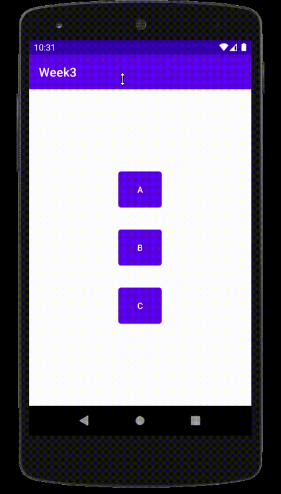
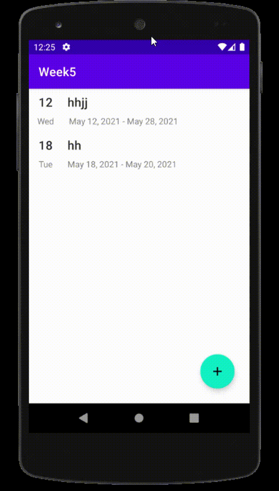

### Week 1) Kotlin에 대해서 알아보자. (~ 04.06.(화)까지)

1. [Kotlin](./assignments/1.md)
2. [자기소개](./Introduce/임혁.md)

### Week 2) 안드로이드 UI 및 Git 실습 (~ 04.25.(일)까지)

1. 패스트 캠퍼스 04 안드로이드 Essential - UI 부분 학습하기 (핵심 개념 : Scrollview, Imageview, Linearlayout)

2. 자신의 취향 or 친한친구가 담긴 Image를 등록하고 Scroll 하여 Image를 볼 수 있도록 만들기

3. 

### Week 3) 안드로이드 액티비티 및 Intent 실습 (~ 05.02.(일)까지)
1. 

### Week 4) 안드로이드 Fragment 실습 (~ 05.09.(일)까지)
1. 

### Week5. 안드로이드 RecyclerView 실습 (~ 05.16.(일)까지)
1. 